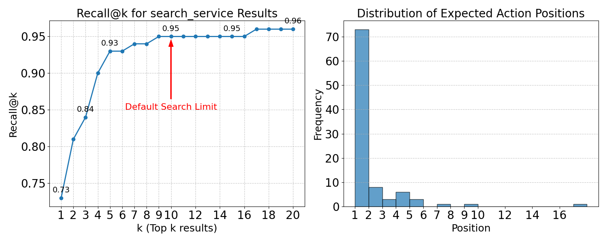

# UnifAI Search Benchmark

This repository contains a benchmark for evaluating the search performance (recall) of UnifAI's service discovery functionality.

## Overview

The benchmark simulates realistic service discovery scenarios by:

1. Generating queries that users might use when looking for specific services
2. Measuring whether the expected service appears in the search results, and at what position
3. Calculating recall@k metrics (the percentage of queries where the expected service appears in the top k results)

## Results

The graph shows the recall rate at different values of k, where k represents the top k search results. A higher recall rate indicates better search accuracy.

## Dataset

The benchmark uses generated search queries stored in `search_queries.jsonl`. Each query represents a realistic user request paired with the expected service that should be found.

The test data was generated by LLM, and you can view the prompt and generation process here: [Claude AI Link](https://claude.ai/share/1e3036fe-4161-4b45-bf67-cab8a86047b5)

## Note

Results may vary based on the specific search queries used and the total number of available actions. At the time of this benchmark, there were 89 actions available in the UnifAI ecosystem.
